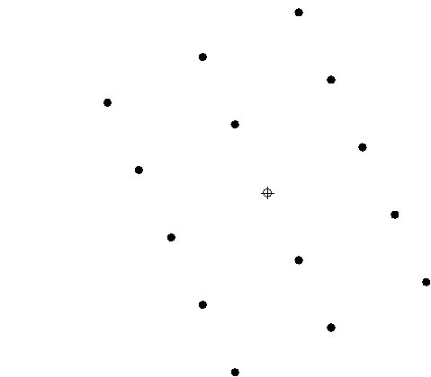
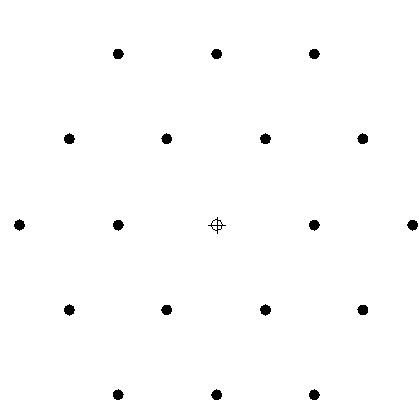

## Post test

 
### Post Test

1. The diffraction angles in a TEM range typically between what range?
    
   A.<input type="radio" name="but" id="rb11" onclick="click1();">&nbsp;0-1°
    
   B.<input type="radio" name="but" id="rb12" onclick="click1();">&nbsp;5-20°
    
   C.<input type="radio" name="but" id="rb13" onclick="click1();">&nbsp;20-80°
    
   D.<input type="radio" name="but" id="rb14" onclick="click1();">&nbsp;0-135°
    
   

    
2. Spotted diffraction pattern is obtained from:
    
   A. <input type="radio" name="but2" id="rb21" onclick="click2();">&nbsp;Single crystal material
    
   B. <input type="radio" name="but2" id="rb22" onclick="click2();">&nbsp;Polycrystalline material
    
   C. <input type="radio" name="but2" id="rb23" onclick="click2();">&nbsp;Amorphous material
    
   D. <input type="radio" name="but2" id="rb24" onclick="click2();">&nbsp; 
   None of these  
   

    

3. Ring diffraction pattern is obtained from:
    
   A. <input type="radio" name="but3" id="rb31" onclick="click3();">&nbsp;Single crystal material
    
   B. <input type="radio" name="but3" id="rb32" onclick="click3();">&nbsp;Polycrystalline material
    
   C. <input type="radio" name="but3" id="rb33" onclick="click3();">&nbsp;Amorphous material
    
   D. <input type="radio" name="but3" id="rb34" onclick="click3();">&nbsp;None of these
     
   

    
4. A halo around central beam (in diffraction mode) is obtained from:
    
   A. <input type="radio" name="but4" id="rb41" onclick="click4();">&nbsp;Single crystal material
    
   B. <input type="radio" name="but4" id="rb42" onclick="click4();">&nbsp;Polycrystalline material
    
   C. <input type="radio" name="but4" id="rb43" onclick="click4();">&nbsp;Amorphous material
    
   D. <input type="radio" name="but4" id="rb44" onclick="click4();">&nbsp;None of these
     
   

    
5. The following diffraction pattern of BCC crystal would have resulted from a zone axis of? ;
    
   A. <input type="radio" name="but5" id="rb51" onclick="click5();">&nbsp;[001]
    
   B. <input type="radio" name="but5" id="rb52" onclick="click5();">&nbsp;[011]
    
   C. <input type="radio" name="but5" id="rb53" onclick="click5();">&nbsp;[111]
    
   D. <input type="radio" name="but5" id="rb54" onclick="click5();">&nbsp; 
     
   

    
6.The following diffraction pattern of BCC crystal would have resulted from a zone axis of? ;
    
   A. <input type="radio" name="but6" id="rb61" onclick="click6();">&nbsp;[001]
    
   B. <input type="radio" name="but6" id="rb62" onclick="click6();">&nbsp;[011]
    
   C. <input type="radio" name="but6" id="rb63" onclick="click6();">&nbsp;
   [111]
    
   D. <input type="radio" name="but6" id="rb64" onclick="click6();">&nbsp;
     
   

    
7. The following diffraction pattern of BCC crystal would have resulted from a zone axis of? ;
    
   A. <input type="radio" name="but7" id="rb71" onclick="click7();">&nbsp;[001]
    
   B. <input type="radio" name="but7" id="rb72" onclick="click7();">&nbsp;[011]
    
   C. <input type="radio" name="but7" id="rb73" onclick="click7();">&nbsp;
   [111]
    
   D. <input type="radio" name="but7" id="rb74" onclick="click7();">&nbsp;
     
   

    
