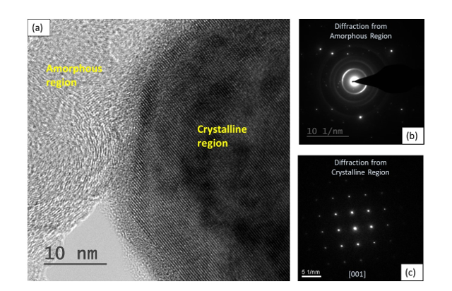
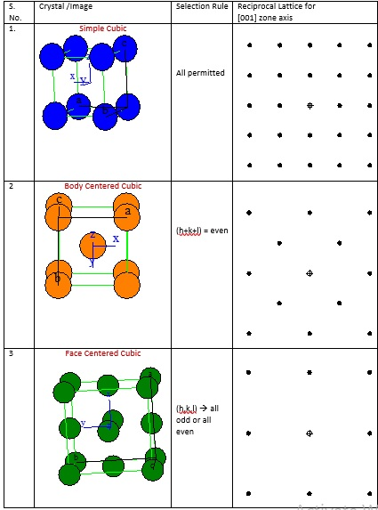
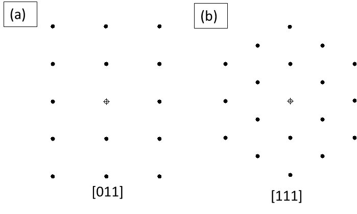
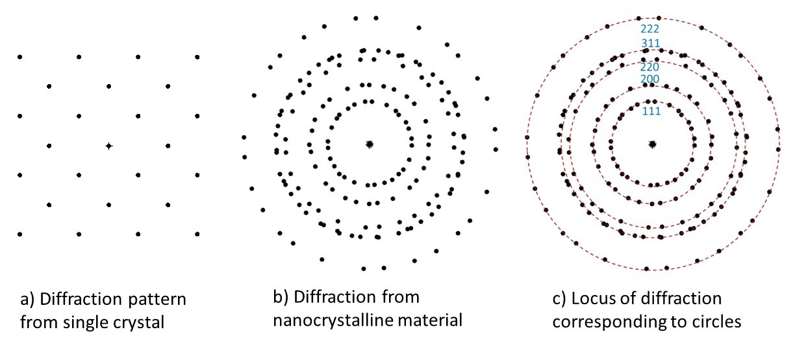

Diffraction pattern is obtained when the aperture in the TEM is kept at the image plane of the objective lens. Here, a selected region can be utilized for the electron beam to diffract. It is interesting to point out here that the electron wavelengths are in the order of pm (pico-meters or ~order of 10-12 m). Considering that the interplanar spacing is the order of few Å (or ~0.3 nm), hence, the Bragg’s condition for diffraction (i.e., 2d Sinθ=nλ) is satisfied within 1° of diffraction angles. Or, in other words, the incident beam is almost parallel to the diffracting planes of the crystal. The direction of incident beam with respect to the crystal is provided by zone axis. In other words, zone axis denotes the axis that lies normal to the plane of diffraction. Or, where the dot product of zone axis with that of diffracting planes is zero.
 
The TEM microstructure captured via bright field imaging (Fig. aa) can be utilized to obtain the corresponding diffraction pattern. An amorphous region usually results a halo (Fig. 1b). Further, it may be pointed out that the symmetry of the crystal will result diffraction spots (if single crystal, Fig. 1c) or a ring pattern (if multi-crystals, usually nanocrystalline result the same). 
 
Fig. 1: a) The bright field TEM image is shown where an amorphous and a crystalline region are forming an interface. Crystalline region shows distinct parallel lines (or row of atoms), whereas the amorphous region does not show that nature. The corresponding selected area diffraction shows c) halo of rings indicating amorphous nature of region, and c) distinct spot pattern indicating single crystal is providing this response. 
Depending on the zone axis (see Table 1), i.e. alignment of the incident beam with respect to that of the crystal, will result difference in diffraction pattern. Note the symmetry that is resulted when the type of a crystal changes from simple cubic to body centered cubic to face centered cubic for the same zone axis of [001]. All the planes do not diffract as that depends on the selection rule. Each crystal symmetry allows only selected combination of (hkl) planes to diffract, which is also presented in Table 1.
  
Table 1: The diffraction pattern of simple cubic (SC), body centered cubic (BCC) and face centered cubic (FCC) for a zone axis of [001].
 

 
If we take a BCC crystal, even then, the diffraction pattern will change if the zone axis is changed, and the corresponding plane symmetry can be visualized. For example, if the zone axis is [011], then the diffraction pattern elicits a rectangular arrangement (extended x-axis, and condensed y-axis) as observed in Fig. 2a. On the other hand, if the zone axis is switched to [111] then the comparative diffraction pattern changes its shape (Fig. 2b). Thus, the symmetry of the diffracting plane can be perceived in the diffraction pattern.
 

 
Fig. 2: a) Diffraction patter of BCC crystal for zone axis of a) [011], and b) [111]. Note the change in the diffraction pattern under these two conditions. Also compare the same with the diffraction pattern observed in BCC [001] provided in Table 1.
 
As we have learnt that in a single crystal, depending upon the zone axis, we obtain a diffraction pattern (Fig. 3a). But, for a polycrystalline (or nanocrystalline) material, the diffraction occurs from all the crystals, and the beam orientation with respect to individual crystal keeps changing (Fig. 3b). In other words, an overlapping diffraction pattern from those differently oriented crystals is resulted (Fig. 3b). So, the equivalent planes (say family of {110} planes) fall at the locus (equidistant from the transmitted beam) to form a circle (Fig. 3c). So, each family of equivalent planes form a circle (instead of a pattern that is expected from a single crystal), as multiple crystals are now present that diffract the beam. Now, the selection rule allows obtaining the indices of the diffraction planes. 
 

 
Figure 3: a) Diffraction pattern from a single crystal, b) When multiple crystals diffract, then the overlapping diffraction patterns are obtained, and c) the locus of same diffracting planes (but at different orientation) falls as a circle, and can be indexed as ‘ring pattern’.
 
It may so happen that the material has texture and a certain orientation my go missing or any other plane my appear at much higher intensity. Nonetheless, those are special cases of diffraction images and can always be accounted for. You may have noticed that here we are only getting a diffraction (either as a spot or ring pattern or even as a halo), but over intention will also be to ‘quantify’ or ‘index’ the spots to be able to provide the orientation relationship of the features with respect to the matrix. For the same, we need to obtain multiple diffraction patterns (from both: the matrix and the feature), and then obtain the angle after indexing the patterns. The indexing of spot/ring patterns will be taken forward in the next experiment.
 
 

<h3> Notes:</h3>
 
1.	Note that the dot product of the zone axis (denoted within square brackets) with the diffracting plane (that the brackets are not used) is zero. 
2.	The zone axis must be mentioned to observe the diffracting planes. 
3.	As the diffraction occurs in reciprocal space, the units (or the separation distance) is presented in the inverse of length. Note the units are (nm)-1 in Figs. 1b-c. 
4.	The vector length separating the planes is inverse of the interplanar spacing. More details will be presented in the next experiment when we index the planes. 
5.	Another interesting fact associated with the thickness of ring also associates that with the crystallite size and associated residual stress (i.e. the limited size crystal have wider spread (or thicker diffracted circle) in the Bragg’s peak, and at the same time the residual stresses change the mean diffraction peak position, and the diffraction circle appears shifted or thicker). 
<video width="320" height="240" controls>
  <source src="images/exp7-DP symmetry.mp4" type="video/mp4">
  Your browser does not support the video tag.
</video> 
Video on Electron Diffraction for various materials

